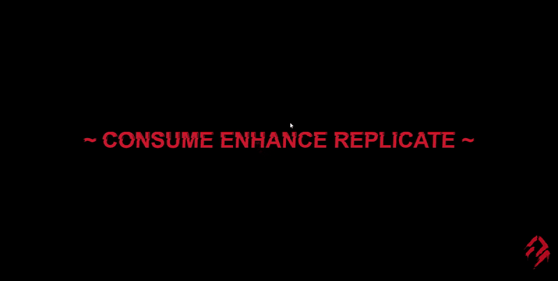
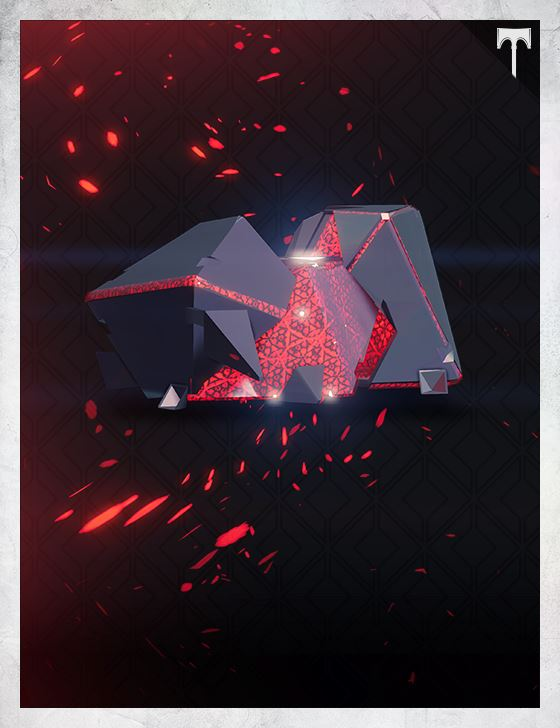
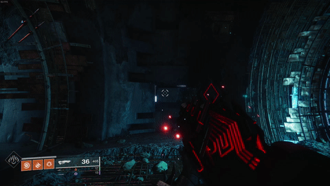
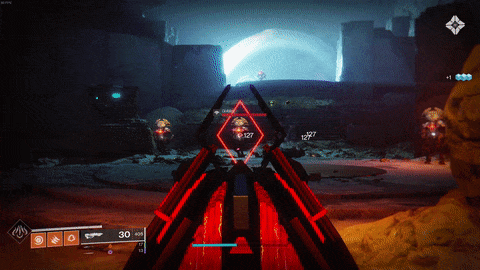

# Particle-Orb

## Description

A lightweight JavaScript/CSS particle animation in the shape of an orb/sphere, inspired by *SIVA Nanite clusters* from the *Destiny* game franchise.

The files within this project display this animation used as the potential landing page for an ARG (Alternate Reality Game) surrounding the concept that inspired it.

### Features

* Swarming particles in the shape of a sphere

* Parallax interactivity with cursor

* Glitching/chromatic aberration text effect

* Easily customisable particle appearance with CSS

* Editable loop duration with JavaScript variable

## Inspiration

### SIVA

> Source: [Bungie.net](https://www.bungie.net/common/destiny_content/grimoire/hr_images/800201_879982ef7660b36b0dbd0351e00d43a3.jpg)

An artifact from *Destiny 1* displaying similar particles to those within the project.

### Outbreak Perfected

> Source: In-game captured footage from *Destiny 2*

A weapon within *Destiny 2* displaying the spherical animation of the particles orbiting the barrel.

> Source: In-game captured footage from *Destiny 2*

A weapon within *Destiny 2* displaying the swarming nature of the SIVA particles.

## Project Status

**Completed**

## License

[MIT](https://choosealicense.com/licenses/mit/)